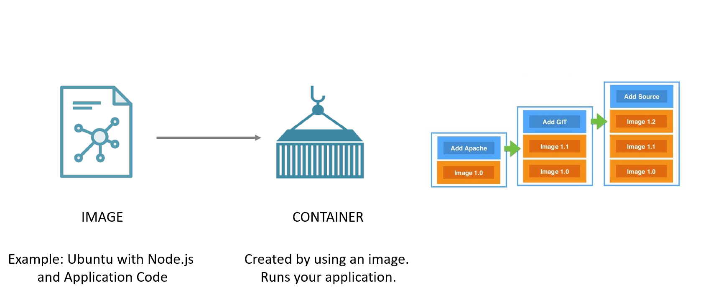
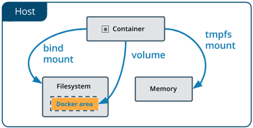
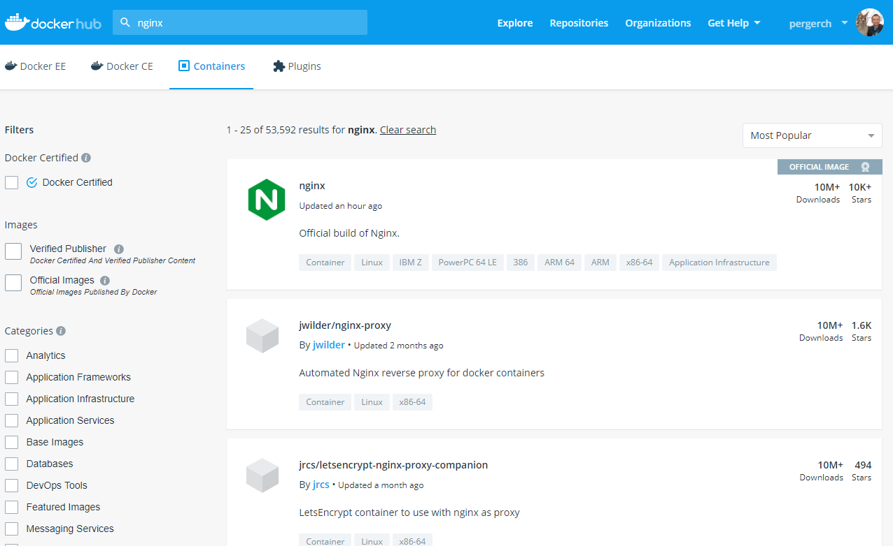

# Docker and containerization

GTT knowledge transfer

March 2019

---

### Agenda

- Docker basics
- Setup
- Storage
- Build or discover images
- Services
- MyBoilerplate
- Swarm
- gDoc2 Dev environment

---

### What is a container?

"A standardized unit of software" - docker

- Container images define the runtime environment
- Containerized software will always run the same, regardless of the infrastructure
- Isolated but lightweight since they don't require an OS per application
- Available on Win & Linux, virtualizes Win & Linux (doesn't have to match)

---

### Comparison between Containers and VMs


---

### Terminology



---

### Example

"Installing" and running a webserver with one line of code

```bash
$ docker run -v /d/webroot:/usr/share/nginx/html:ro -p 8080:80 nginx
```

```bash
Unable to find image 'nginx:latest' locally
latest: Pulling from library/nginx
27833a3ba0a5: Already exists
e83729dd399a: Already exists
ebc6a67df66d: Already exists
Digest: sha256:c8a861b8a1eeef6d48955a6c6d5dff8e2580f13ff4d0f549e082e7c82a8617a2
Status: Downloaded newer image for nginx:latest
172.17.0.1 - - [28/Mar/2019:14:05:46 +0000] "GET /index.html HTTP/1.1" 304 0 "-" "Mozilla/5.0 (Windows NT 10.0; Win64; x64) AppleWebKit/537.36 (KHTML, like Gecko) Chrome/72.0.3626.121 Safari/537.36" "-"
```

---

### Storage options 



- Volumes - stored in a part of the host filesystem BUT managed by Docker
- Bind mount – "shared" folder from the host. Non-Docker processes on the host can modify them at any time
- Tmpfs - in the host system’s memory only

---

### Dockerfile

- A recipe for building a docker image
- The Dockerfile is a textfile with commands similar to a batch file
- `docker build` will execute the commands, creates (read-only) layers and resulting (writable) image

```bash
FROM ubuntu:18.04
COPY . /app
RUN make /app
CMD python /app/app.py
```

Each layer is the "delta" on top of the previous layer.

---

### Discovering docker images

[https://hub.docker.com/](https://hub.docker.com/)

