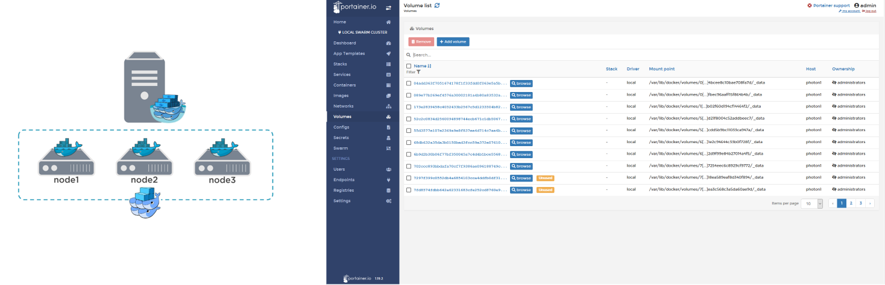

# Docker and containerization

GTT knowledge transfer

March 2019

---

### Agenda

- Docker basics
- Setup
- Storage
- Build or discover images
- Compose
- gDoc2 Dev environment
- Swarm

---

### What is a container?

"A standardized unit of software" - docker

- Container images define the runtime environment
- Containerized software will always run the same, regardless of the infrastructure
- Isolated but lightweight since they don't require an OS per application
- Available on Win, Mac & Linux, virtualizes Win & Linux (doesn't have to match) - _side note: hybrid mode is in the making_

---

### Comparison between Containers and VMs


---

### Terminology and Layers


---

### Setup

- On Windows install [Docker Desktop](https://hub.docker.com/editions/community/docker-ce-desktop-windows)
- You will need to activate the Hyper-V feature
- Share the C / D drive, this can be [a bit challenging](https://tomssl.com/2018/01/11/sharing-your-c-drive-with-docker-for-windows-when-using-azure-active-directory-azuread-aad/) in the corporate environment
- Select to run windows or linux containers
- _Bonus:_ Modify the ports of gDoc2 API and website to not use any blocked ones (`netsh interface ipv4 show excludedportrange tcp
`)

---

### Example

"Installing" and running a webserver with one line of code

```bash
$ docker run -v /d/webroot:/usr/share/nginx/html:ro -p 8080:80 nginx
```

```bash
Unable to find image 'nginx:latest' locally
latest: Pulling from library/nginx
27833a3ba0a5: Already exists
e83729dd399a: Already exists
ebc6a67df66d: Already exists
Digest: sha256:c8a861b8a1eeef6d48955a6c6d5dff8e2580f13ff4d0f549e082e7c82a8617a2
Status: Downloaded newer image for nginx:latest
172.17.0.1 - - [28/Mar/2019:14:05:46 +0000] "GET /index.html HTTP/1.1" 304 0 "-" "Mozilla/5.0 (Windows NT 10.0; Win64; x64) AppleWebKit/537.36 (KHTML, like Gecko) Chrome/72.0.3626.121 Safari/537.36" "-"
```

---

### Storage options 


- Container-internal
- Tmpfs - in the host system’s memory only (available on linux)
- Volumes - stored in a part of the host filesystem BUT managed by Docker
- Bind mount – "shared" folder from the host. Non-Docker processes on the host can modify them at any time

---

### Dockerfile

- A recipe for building a docker image
- The Dockerfile is a textfile with commands similar to a batch file
- `docker build .` will execute the commands, creates (read-only) layers and resulting (writable) image

```bash
FROM ubuntu:18.04
COPY . /app
RUN make /app
CMD python /app/app.py
```

Each layer is the "delta" on top of the previous layer.

---

### Discovering docker images

[https://hub.docker.com/](https://hub.docker.com/)


---

### Docker-compose / Stacks

Compose is a tool for defining and running multi-container Docker applications. A YAML file configures the required services. _Side note: This is very similar to stacks in docker swarm_

```yaml
version: '3'
services:
  web:
    build: .
    ports:
     - "5000:5000"
  redis:
    image: "redis:alpine"
```

```bash
$ docker-compose up
Creating network "composetest_default" with the default driver
Creating composetest_web_1 ...
Creating composetest_redis_1 ...
Creating composetest_web_1
Creating composetest_redis_1 ... done
Attaching to composetest_web_1, composetest_redis_1
```

---

### gDoc2 Dev environment

- 3 custom made images
  - MSSQL
  - Conference Portal
  - Seq
- Based on the (same) latest Windows Server Core version
- Setting default values, attaching DBs, installing certificate
- Published in a (secure) container registry (ungtt.azurecr.io)
- One simple command to run:

```bash
$ docker-compose up
```

---

### Dockerize ASP.NET Core application (bonus)

- Right-click on project - Add - Container Orchestrator support
- Select Windows or Linux
- Dockerfile and docker-compose are created (incl. development profile)
- F5 to run

Example of practical use can be found here: 
[https://github.com/pergerch/MyBoilerplate](https://github.com/pergerch/MyBoilerplate)

_Showcases ENV variables / options pattern, health checks, shared volume_

---

### Docker Swarm

- Cluster management integrated with Docker Engine
- Scaling & self-healing
- Load balancing through multi-hostt networking
- Secure by default (TLS communication enforced)
- Rolling updates
- Hybrid swarm setup possible (mixing win and linux nodes)
- Powerful management & monitoring tools available ([Portainer](https://www.portainer.io/), [Traefik](https://traefik.io/), [Swarmstack](https://github.com/swarmstack/swarmstack), etc.)



---

### Discussion and Questions?